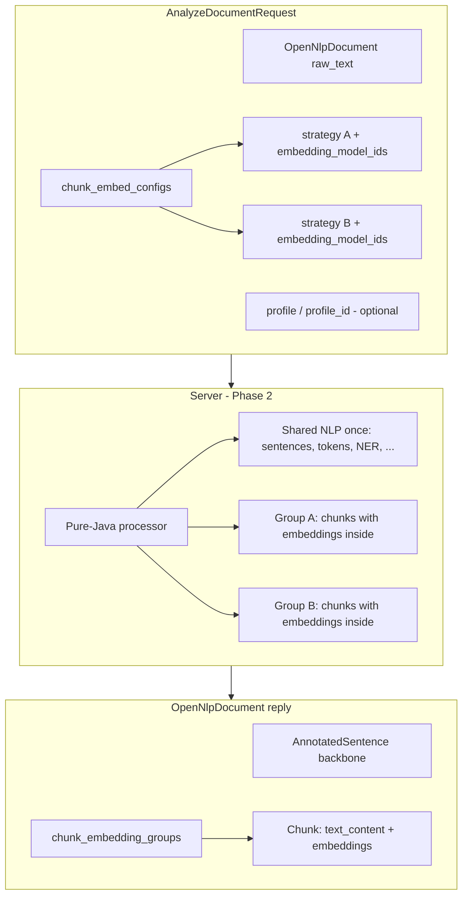
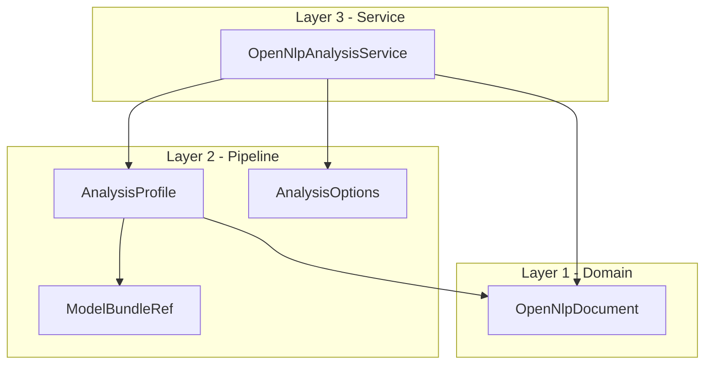
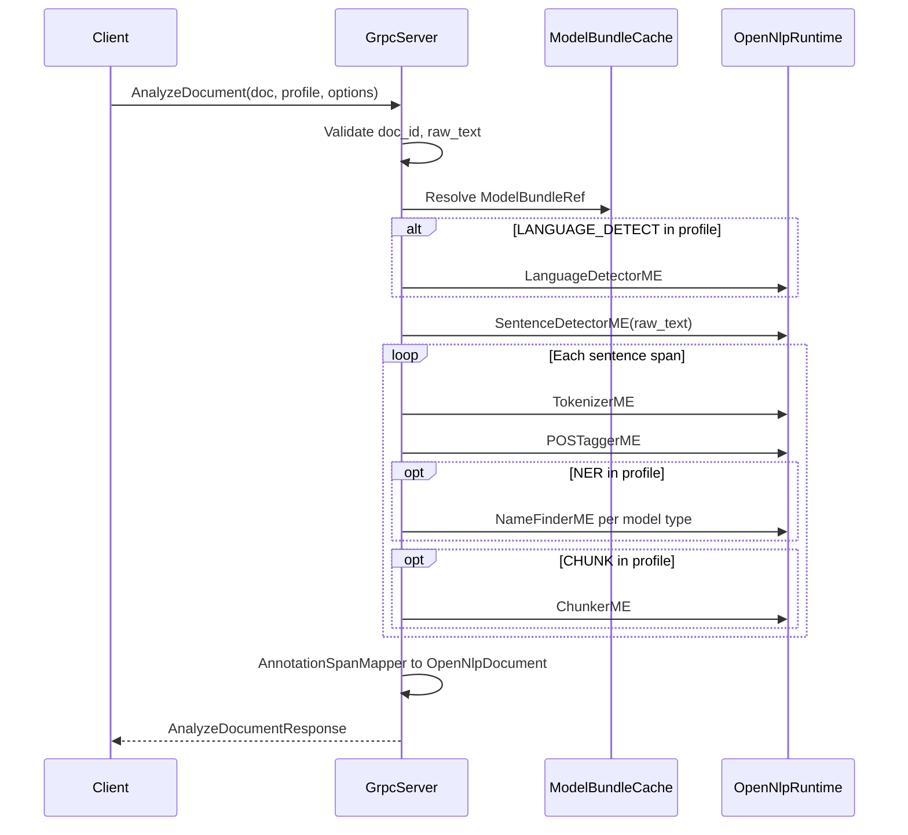

# OpenNLP gRPC API - Design Document (Phase 1)

## Summary

OpenNLP is a mature JVM library. Teams load models, run tokenizers and taggers, extract entities, and-more and more-generate embeddings, all in-process inside a Java application. That model still makes sense for many use cases. But a lot of modern stacks do not look like that: Python data pipelines, Go or Rust microservices, search platforms that want annotated text with chunks and vectors in one pass, and deployments where GPU-backed inference belongs on a shared service rather than in every container.

The sandbox gRPC proof of concept showed that exposing OpenNLP over the network works. This RFC is the next step: evolve that POC into a **document-centric, language-neutral** API. You send text (or a partially analyzed document) and get back a single, structured result-sentences and tokens, named entities, optional syntactic chunks, multiple segmentation strategies each with their own embeddings, and diagnostics when something optional did not quite land. The core library stays free of gRPC; the wire contract lives in optional Maven modules so embedders are not forced to take on networking dependencies.

### Why we're doing this

The legacy sandbox exposed separate RPCs per tool-tokenize here, tag there, find entities somewhere else. That is faithful to how the Java API is organized, but it pushes orchestration onto every client. Real workflows need the full picture: linguistic structure, retrieval-oriented chunks, and vectors, produced in the right order without the caller wiring six calls together.

We also hear clearly from the community that **chunking and embeddings belong in v1**, not as a later add-on. Search, hybrid retrieval, and RAG-style indexing all want "give me this document, chunked and embedded, ready to index"-often with more than one chunking strategy in the same run so you can compare sentence-level vs. fixed-window approaches without paying for tokenization and NER three times over.

Finally, OpenNLP should not require every downstream system to host the JVM. A strongly typed binary protocol-protobuf over gRPC-is how many services already talk to each other. Meeting that expectation lowers the friction for polyglot teams and for platforms that already standardize on gRPC for internal APIs.

### What it can unlock

**gRPC-native integration.** Systems that already speak gRPC get a first-class way to call OpenNLP: discover what models and profiles the server offers, submit a document, receive a typed result. No one-off REST schemas, no ad-hoc JSON field naming, no JNI shim in every language binding.

**Polyglot document enrichment.** A Python ingestion job, a Go API layer, and a Rust indexer can all send the same document shape and receive the same annotated structure back. That makes cross-language pipelines easier to build, test, and operate-you are not maintaining parallel "how we call OpenNLP" stories in every repo.

**Streaming and incremental results.** Long documents and live text feeds should not block on one monolithic response at the end. The contract is shaped so analysis can stream partial results as they are ready-sentences as they are detected, chunks and embeddings as groups complete-rather than forcing the client to wait for the entire pipeline to finish.

**Shared NLP infrastructure.** One well-provisioned OpenNLP server-with GPUs when embedding workloads warrant it-can serve many lightweight clients. Model loading, versioning, and heavy inference concentrate where the hardware is, instead of duplicating JVMs and model bundles across every service.

**Search, RAG, and semantic indexing in one shot.** Multiple chunk-and-embed configurations in a single analysis run means a single ingestion path can feed a sentence-level index, a fixed-window RAG store, and an experimental strategy side by side. The linguistic backbone is computed once; each strategy gets its own group of chunks with embeddings carried inside them.

**Two-way flexibility for JVM teams.** Non-JVM clients call the server over the network. Java applications can do the same when they want to offload heavy steps-or keep using a pure-Java processor in-process when that is simpler. Same conceptual document model either way, with a path later toward a small gRPC-free core type in opennlp-api.

Phase 1 is agreement on this contract-the protos and the design captured here. Implementation in the sandbox and graduation toward an Apache OpenNLP release follow once the community is comfortable with the shape.

## Design

**Canonical location:** Living design doc for [OPENNLP-1833](https://issues.apache.org/jira/browse/OPENNLP-1833). Active work happens in **opennlp-sandbox** on branch `OPENNLP-1833-grpc-expansion`. Proto sources: `opennlp-grpc-api/src/main/proto/org/apache/opennlp/grpc/v1/`.


| Field                | Value                                            |
| -------------------- | ------------------------------------------------ |
| **Status**           | Draft RFC                                        |
| **Version**          | 0.8                                              |
| **API version**      | `v1`                                             |
| **OpenNLP baseline** | 3.0.0-SNAPSHOT (JDK 21+)                         |
| **Companion**        | [JIRA proposal](./opennlp-grpc-jira-proposal.md) |


---

# Part I - Overview

## Where we are

This RFC evolves the sandbox gRPC POC into a **document-centric, language-neutral** contract: one `AnalyzeDocument` RPC that takes `raw_text` in and returns an enriched `OpenNlpDocument` - sentences, tokens, entities, optional chunk groups with embeddings, diagnostics, and more.

**What exists today (on the sandbox branch):**


| Artifact                                                                                | Status                          |
| --------------------------------------------------------------------------------------- | ------------------------------- |
| v1 protos (`opennlp_document.proto`, `opennlp_pipeline.proto`, `opennlp_service.proto`) | Stable; Maven + Buf lint        |
| This RFC + JIRA companion                                                               | Written                         |
| v1 Java processor / server / codegen                                                    | In progress (sandbox)           |
| Core `opennlp-api` `Document` interface                                                 | Proposed for later              |


**Phase 1 deliverable:** design consensus + stable wire contract. **Phase 2:** implementation in the sandbox, then graduation to `apache/opennlp` (target ~3.1.x per community feedback).

## Target architecture

One call. Shared NLP backbone computed once. Multiple chunking strategies, each with explicitly named embedding models. Embeddings live **inside** each chunk in the reply.




**Request rule:** chunking strategy first. Per strategy, the caller names which `embedding_model_ids` to apply to that strategy's chunks. This is **not** an automatic N×M cartesian product unless the caller explicitly requests multiple strategies.

**Reply rule:** `ChunkEmbeddingGroup` holds the chunks for one strategy. Each `Chunk` repeats `text_content` for convenience and carries `repeated EmbeddingResult embeddings` inside it. The shared `AnnotatedSentence` list is the linguistic backbone computed once.

## Key design decisions


| Topic                    | Decision                                                                               |
| ------------------------ | -------------------------------------------------------------------------------------- |
| **Primary RPC**          | `OpenNlpAnalysisService.AnalyzeDocument`                                               |
| **Package**              | `org.apache.opennlp.grpc.v1`                                                           |
| **Legacy POC**             | Removed; single v1 server surface only                                                 |
| **Core library**         | Stays gRPC-free; wire API in optional Maven modules                                    |
| **Build**                | Maven + `protobuf-maven-plugin` only                                                   |
| **CHUNK + EMBED**        | First-class v1 steps (`ChunkerME`, `SentenceVectorsDL`, segmentation chunking)         |
| **GPU / providers**      | Server-side backend SPI (`model.embedder.backend`); CUDA/OpenVINO as optional modules |
| **Multi-group**          | `repeated ChunkEmbedConfigEntry` in request → `repeated ChunkEmbeddingGroup` in reply  |
| **Embeddings placement** | Inside `Chunk`, not a separate flat list per model                                     |
| **Partial failures**     | Required steps fail the RPC; optional steps return best-effort + diagnostics           |
| **Stateless contract**   | One document per RPC; `clear_adaptive_data` controls NER adaptive state only           |


## Community consensus (dev@, May–June 2026)

Feedback from Martin Wiesner, Richard Zowalla, and others on OPENNLP-1833:

- **Sandbox-first** - iterate here, graduate to main after review; no rush for 3.0.0.
- **Neutral core `Document` interface** - small gRPC-free type in `opennlp-api` later; `OpenNlpDocument` is the wire form.
- **Embeddings and chunking in v1** - not deferred; GPU acceleration via optional provider modules.
- **Discovery** - `ListModelBundles` + `GetServiceInfo` must expose enough metadata to choose bundles/profiles.
- **Two-way usage** - other languages call the server; JVM code can call the server via stubs for heavy steps; a pure-Java processor underneath supports in-process use too.

## What comes next

1. Community review of this RFC + v1 protos.
2. Wire `protobuf-maven-plugin`, generate stubs.
3. Pure-Java processor: shared NLP once → per-strategy groups → embeddings inside chunks.
4. Minimal `AnalyzeDocument` server implementation.
5. Propose core `Document` / `AnalyzedDocument` API in `opennlp-api`.

---

# Part II - Specification

## 1. Goals

1. Define a **language-neutral, document-centric** gRPC contract for Apache OpenNLP inference.
2. Enable **cross-platform clients** (Python, Go, Rust, etc.) without JNI or embedding the JVM in every service.
3. Support a **single-call pipeline** (`AnalyzeDocument`) that replaces client-side chaining of granular RPCs.
4. Preserve a clean separation: **core library stays gRPC-free**; wire API lives in optional Maven modules.
5. Include **CHUNK and EMBED as first-class v1 steps** (using existing OpenNLP `ChunkerME` and `SentenceVectorsDL` from opennlp-dl for ONNX embeddings). Advanced GPU acceleration (CUDA via onnxruntime-gpu, OpenVINO for Intel) and hot-swappable provider implementations live behind a narrow middle interface / provider SPI; these can be delivered in separate optional modules/builds without changing the wire contract or core processor.

## 2. Non-goals

See JIRA proposal. Additionally for Phase 1 design only: no server implementation, no deployment guide, no performance SLAs.

## 3. Background

### 3.1 Main repository

- Maven multi-module library; public API in `opennlp-api`, engines in `opennlp-runtime`.
- No `.proto` files or gRPC dependencies on `main`.
- NLP tasks map to Java interfaces (`Tokenizer`, `SentenceDetector`, `POSTagger`, `TokenNameFinder`, etc.).

### 3.2 Sandbox POC

Location: [https://github.com/apache/opennlp-sandbox/tree/main/opennlp-grpc](https://github.com/apache/opennlp-sandbox/tree/main/opennlp-grpc)

Modules:

- `opennlp-grpc-api` - v1 protos under `org.apache.opennlp.grpc.v1`, Maven-generated stubs
- `opennlp-grpc-service` - `OpenNlpGrpcServer`, document processor, directory/JAR model scanning
- `examples` - client samples (v1 Python TBD)

The original per-tool POC (`package opennlp`, three granular services) has been removed from the sandbox branch in favor of the v1 document-centric API only.

### 3.3 UIMA reference pipeline

`OpenNlpTextAnalyzer.xml` delegates: SentenceDetector → Tokenizer → NameFinders → PosTagger → Chunker → Parser.

The gRPC server orchestrator should mirror this **order** when steps are enabled in `AnalysisProfile`.

### 3.4 Deep learning / GPU (v1 + provider evolution)

- `opennlp-dl`: ONNX Runtime support including `SentenceVectorsDL` for embeddings, plus `NameFinderDL` and `DocumentCategorizerDL`. These are the foundation for the v1 `EMBED` step (and future DL-backed NER/categorization).
- `opennlp-dl-gpu`: swaps the CPU onnxruntime for `onnxruntime_gpu` (CUDA on NVIDIA). This is one of the concrete provider implementations behind the hot-swap story.
- A narrow provider SPI (a `ServiceLoader`-discovered `EmbeddingBackendFactory` keyed by an open backend id string) allows the pure-Java processor (and thus the gRPC server) to dispatch `EMBED` (and later other steps) to different backends. Backend selection is a server deployment concern (`model.embedder.backend=onnx|cuda|<spi-id>`), not part of the wire contract: clients request models by id, and the backend serving each model is reported in `ModelDescriptor.backend_id`. Built-in ids are `onnx` (ONNX Runtime CPU) and `cuda` (NVIDIA, via `onnxruntime_gpu`). Two optional remote backend modules ship alongside the server and prove the SPI's cross-process/cross-language reach: `opennlp-grpc-backend-tei` (id `tei`, a gRPC client for HuggingFace Text Embeddings Inference) and `opennlp-grpc-backend-openvino` (id `openvino`, a KServe v2 open-inference-protocol client for OpenVINO Model Server, Triton, etc.). DJL or further runtimes can register their own ids from separate optional modules with their own build artifacts and dependencies. The base `opennlp-grpc-server` (and any pure-Java processor usage) does not force heavy native dependencies.
- CHUNK and EMBED (with basic ONNX) are in-scope for the initial v1 contract and sandbox implementation. Advanced acceleration and additional providers are implementation work that does not require wire changes.

The initiating email for OPENNLP-1833 emphasizes GPU embeddings (CUDA for NVIDIA, OpenVINO for Intel) with a hot-swappable middle interface whose implementations are their own builds. This design makes that explicit via the provider mechanism while keeping the `OpenNlpDocument` / `AnalyzeDocument` contract stable.

---

## 4. Architecture

### 4.1 Module layout (implementation phases 2+)

```
apache/opennlp/
├── opennlp-api/              # unchanged
├── opennlp-runtime/          # unchanged
├── opennlp-grpc-api/         # NEW: protos + generated code
├── opennlp-grpc-server/     # NEW: Netty/shaded server, orchestrator
└── opennlp-grpc-examples/    # NEW: optional samples
```

Dependency rule: `opennlp-grpc-server` → `opennlp-grpc-api`, `opennlp-runtime`, `opennlp-model-resolver`; optional `opennlp-dl-gpu`.

### 4.2 Three-layer proto model




| Layer | File (proposed)          | Responsibility                                           |
| ----- | ------------------------ | -------------------------------------------------------- |
| 1     | `opennlp_document.proto` | Document, spans, tokens, entities, analytics, embeddings |
| 2     | `opennlp_pipeline.proto` | Profiles, steps, model refs, options, backends           |
| 3     | `opennlp_service.proto`  | gRPC services and request/response envelopes             |


All files share `package org.apache.opennlp.grpc.v1`.

### 4.3 Runtime flow




---

## 5. Offset and span contract

OpenNLP Java APIs mix coordinate systems:


| API                              | Span reference                    |
| -------------------------------- | --------------------------------- |
| `Tokenizer.tokenizePos`          | Character offsets in input string |
| `SentenceDetector.sentPosDetect` | Character offsets in document     |
| `TokenNameFinder.find(String[])` | **Token indices** in sentence     |
| `DocumentNameFinder`             | Per-sentence token indices        |


**Wire contract (mandatory for v1):**

- Every `AnnotationSpan` in `OpenNlpDocument` and in RPC responses MUST use `CoordinateSpace.COORDINATE_SPACE_CHAR_DOCUMENT` unless explicitly documented otherwise.
- Offsets are **half-open** `[start, end)` into `raw_text`, matching `opennlp.tools.util.Span`.
- Offset units are explicit: `OpenNlpDocument.offset_encoding` records whether all spans are UTF-8 byte offsets, Java/OpenNLP UTF-16 code-unit offsets, or Unicode code-point offsets. `AnalysisOptions.offset_encoding` selects the response encoding; unset means UTF-8 bytes.
- The server is solely responsible for converting Java/OpenNLP offsets and token-index spans into the requested wire offset encoding before returning.

---

## 6. Model lifecycle

### 6.1 Server-side models

- Classic models: Java-serialized `.bin` in ZIP/JAR (unchanged).
- Models are **never** sent inline in `AnalyzeDocumentRequest`.
- Server loads the default `en-basic` bundle from the classpath via `DefaultClassPathModelProvider` (the `opennlp-models-*` runtime deps); optional `model.sentence_detector.path` / `model.tokenizer.path` config keys override with explicit `.bin` files.

### 6.2 ModelBundleRef and discovery

`ModelBundleRef` is a compact logical handle used in requests:

```protobuf
message ModelBundleRef {
  string bundle_id = 1;
  repeated ComponentModelRef component_models = 2;
}

message ComponentModelRef {
  ComponentType component_type = 1;
  string model_hash = 2;
}
```

Example `ComponentType` values: `COMPONENT_TYPE_TOKENIZER`, `COMPONENT_TYPE_SENTENCE_DETECTOR`, `COMPONENT_TYPE_POS_TAGGER`, `COMPONENT_TYPE_NAME_FINDER`, `COMPONENT_TYPE_EMBEDDER`, `COMPONENT_TYPE_LANGUAGE_DETECTOR`.

Server config (or a model resolver) maps `bundle_id` → concrete artifacts/paths. Clients can send only `bundle_id` when using server-defined profiles.

**Discovery (addresses community feedback)**: A bare `bundle_id` is not sufficient for clients to explore what is available. The service therefore exposes:

- `GetServiceInfo` → high-level `available_profile_ids` and `supported_steps`.
- `ListModelBundles` → `ListModelBundlesResponse` containing `ModelBundleInfo` entries.

`ModelBundleInfo` / `ModelDescriptor` (see full proto in 11.2–11.3) are intended to carry enough metadata for real client discovery:

- `locale` / language.
- Component types present (for example `COMPONENT_TYPE_SENTENCE_DETECTOR`, `COMPONENT_TYPE_TOKENIZER`, `COMPONENT_TYPE_EMBEDDER`).
- Supported or typical `PipelineStep` values this bundle is intended to serve.
- Optional free-form capabilities or tags.

Implementations should populate these fields so that a client can list bundles, filter by language or capability (e.g. "has an embed component"), and then pick a `bundle_id` or `profile_id`. The exact richness of the descriptors can grow over time without breaking v1 clients (additive fields only).

The current sandbox slice resolves a single shared `en-basic` bundle through `DefaultClassPathModelProvider` (`opennlp-grpc.model.ModelBundleCache`). Multi-bundle resolution by `bundle_id` / `component_models`, directory/JAR discovery (e.g. via OPENNLP-1829's `DirectoryModelFinder` once it ships in the dependency), and ONNX embedding artifacts (model + vocab pairs) as first-class bundle components are deferred to later phases.

### 6.3 Profiles

Predefined profiles in server config (e.g. `en-basic`, `en-ner`):

```ini
profile.en-basic.bundle_id=en-default
profile.en-basic.steps=SENTENCE_DETECT,TOKENIZE,POS_TAG
```

`GetServiceInfo` returns available `profile_id` values.

### 6.4 Thread safety

OpenNLP 3.0 documents thread-safe `*ME` classes. The server holds **one instance per loaded model** in `ModelBundleCache`, shared across gRPC executor threads.

### 6.5 Stateful NER and adaptive data

Certain OpenNLP components (notably `NameFinderME` / `TokenNameFinder`) maintain "adaptive data" that can improve consistency *within a single document* (e.g., once "John" is tagged as a person early in a long text, later mentions of "John" can benefit from that context). `TokenNameFinder.clearAdaptiveData()` resets this state.

In the gRPC contract:

- `AnalysisOptions.clear_adaptive_data` (default: `true`) controls whether the server calls `clearAdaptiveData()` on applicable components **after** processing the current `AnalyzeDocument` request.
- `true` (the default) ensures that each RPC is independent with respect to adaptive state. This matches the common expectation of a stateless document-centric API.
- `false` leaves the adaptive state in the cached `*ME` instance for the bundle. A *sequence* of calls from the same logical client/session that target the same bundle can therefore benefit from cross-document (but within-"session") adaptive hints. This is an advanced, opt-in behavior and is not the normal mode for the 1:1 document contract.

### 6.6 Stateless RPC contract

Each `AnalyzeDocument` call is a self-contained, stateless operation on the wire: one `raw_text` document in, one enriched `OpenNlpDocument` (plus diagnostics) out. There is no session, cursor, or cross-call mutable state in the public contract.

Adaptive data (6.5) and any internal caches (model instances, bundle resolution) are implementation details of the server-side processor and the specific OpenNLP components. They are scoped to a loaded bundle inside the server process and do not leak into the protobuf messages or require clients to manage server-side sessions.

If a deployment needs stateful document sequences (for example, a long-running "conversation" or a large report split across multiple calls that should share NER adaptive data), it can do so by:

- Using the same `bundle_id` / profile.
- Setting `clear_adaptive_data=false` for the duration of the sequence.
- Managing its own correlation (e.g. via `doc_id` or metadata) and eventually calling with `clear_adaptive_data=true` (or a fresh bundle context) to reset.

Cross-client or long-lived shared mutable state across unrelated documents is strongly discouraged and outside the intended use of the v1 contract.

---

## 7. Error handling and partial results policy

**gRPC status codes** are used for fatal failures that prevent a useful response:

- `INVALID_ARGUMENT`: bad request (missing raw_text, unknown profile_id when no inline profile, invalid options, etc.).
- `NOT_FOUND`: unknown `profile_id` or `bundle_id` that cannot be resolved.
- `INTERNAL`: unrecoverable model or orchestration error after a step has started.

**Per-step diagnostics** are always populated in `AnalyzeDocumentResponse.diagnostics` (even on success paths) for observability:

- `INFO`: step skipped because it was not requested or not applicable.
- `WARNING`: non-fatal issue (e.g. optional NER type had no model in the bundle; a provider fell back; low-confidence result).
- `ERROR`: a step failed but the server chose (or was configured) to continue with partial results.

**Partial results policy (addresses community feedback)**:

- The contract favors **useful partial results** for non-critical failures so that clients (especially cross-language ones doing RAG pipelines) can still make progress.
- If a **required** step (as determined by the `AnalysisProfile.steps` and server policy for that profile - e.g. SENTENCE_DETECT or TOKENIZE when later steps depend on them) fails with an ERROR diagnostic, the RPC **fails** with an appropriate gRPC status and the diagnostics attached (best-effort document may still be returned in the response for debugging, but callers must check status).
- If an **optional** or **best-effort** step fails (e.g. a particular NER entity type, CHUNK when the profile treats it as enrichment, or an EMBED provider that is temporarily unavailable), the server returns `OK` (or the normal response code) with:
  - The document populated as far as successful steps reached.
  - One or more `ProcessingDiagnostic` entries with severity `ERROR` or `WARNING` and `component_key` identifying the failing piece (e.g. "ner_person", "embed_minilm").
- Profiles and future `AnalysisOptions` (e.g. a `strict` flag) can influence what is treated as required vs. optional. The default is pragmatic partial success for enrichment steps.
- Clients should always inspect `diagnostics` rather than assuming a successful status code means every requested step produced perfect output.

This policy is intentionally documented early so that Python/Go/Rust/etc. clients written against v1 have predictable behavior. The sandbox implementation will include tests that exercise both full-success and partial-failure paths.

---

## 8. Versioning and compatibility

- Package path includes `v1`; breaking changes require `v2` package.
- Use `reserved` for removed fields; never reuse field numbers.
- `GetServiceInfoResponse.api_version` reports proto/API version string (e.g. `"1.0.0"`).
- The removed sandbox `opennlp` package POC is **not** wire-compatible with v1.
- v1 protos are linted with [Buf](https://buf.build) STANDARD rules (`opennlp-grpc-api/buf.yaml`). Run: `cd opennlp-grpc-api && buf lint`. Enum values use type prefixes (e.g. `PIPELINE_STEP_SENTENCE_DETECT`) to satisfy `ENUM_VALUE_PREFIX` and avoid cross-enum name collisions in protobuf.

---

## 9. Security and operations (deployment)

Out of scope for proto, noted for implementers:

- TLS termination at load balancer or Netty server
- Model path isolation and read-only mounts
- Resource limits (max `raw_text` size, deadline per RPC)
- gRPC reflection optional (sandbox supported via config)

---

## 10. Future phases (implementation - not Phase 1)


| Phase | Deliverable                                                                                                                                                                                                                              |
| ----- | ---------------------------------------------------------------------------------------------------------------------------------------------------------------------------------------------------------------------------------------- |
| 2a    | `opennlp-grpc-api` module, codegen, proto tests (including CHUNK/EMBED shapes)                                                                                                                                                           |
| 2b    | Pure-Java processor/orchestrator + `AnnotationSpanMapper` + basic CHUNK (sentence+overlap segmentation) + EMBED via `SentenceVectorsDL`; unit tests                                                                                            |
| 2c    | gRPC server host (delegating to processor), config for bundles/profiles, model discovery for both classic + ONNX embedding artifacts, integration tests, sandbox port + updated Python example                                           |
| 2d    | Graduate modules to `apache/opennlp` (after community review); optional core `Document` interface alignment if not already landed in 3.0.0-M4                                                                                            |
| 3     | Provider SPI hardening; first CUDA (`opennlp-dl-gpu`) and OpenVINO provider modules as separate optional builds; hot-swap / priority selection examples                                                                                  |
| 4     | Richer bundle discovery (languages, supported steps per bundle in `ModelBundleInfo`), streaming variants of AnalyzeDocument or dedicated chunk/embed streams, additional steps (PARSE, LEMMATIZE, SENTIMENT, etc.) if not already in 2.x |
| Later | Advanced semantic chunking driven by embeddings, more inference backends (DJL direct, remote KServe via the same provider abstraction), Buf Schema Registry publication, official multi-language client examples beyond Python           |


---

## 11. Full protobuf definitions (Phase 1 deliverable)

**Note:** The authoritative .proto sources that will be used to start the sandbox implementation
live under `opennlp-grpc-api/src/main/proto/org/apache/opennlp/grpc/v1/`. The blocks below
are the canonical text form for the RFC and are kept in sync with those files.

### 11.1 `opennlp_document.proto`

```protobuf
// Licensed to the Apache Software Foundation (ASF) under one or more
// contributor license agreements.  See the NOTICE file distributed with
// this work for additional information regarding copyright ownership.
// The ASF licenses this file to You under the Apache License, Version 2.0

syntax = "proto3";

package org.apache.opennlp.grpc.v1;

option java_package = "org.apache.opennlp.grpc.v1";
option java_multiple_files = true;

// Canonical 1:1 NLP document: text in, annotations out.
// The base linguistic structure (sentences + tokens + entities + classic chunks etc.)
// is the shared "backbone" - computed once when any CHUNK or EMBED step is active.
// Multiple independent groups of (chunks + embeddings) can be produced in one
// AnalyzeDocument run. Shared NLP analysis is computed once; each group is
// traceable by its chunk/embedding config or profile fragment and attaches
// vectors via source spans (a chunk or sentence region can have embeddings
// from more than one model).
message OpenNlpDocument {
  string doc_id = 1;
  string raw_text = 2;
  optional string detected_language = 3;
  optional float language_confidence = 4;
  repeated AnnotatedSentence sentences = 5;
  optional DocumentAnalytics analytics = 6;
  google.protobuf.Struct metadata = 7;
  repeated EmbeddingResult embeddings = 8;  // denormalized "all embeddings with spans" view (optional convenience)
  optional DocumentClassification classification = 9;

  // Multiple chunk + embedding result groups from this analysis (the primary
  // way to carry more than one chunking strategy in one document).
  // Shared linguistic backbone (sentences above) is computed once; each group
  // applies its chunking strategy and named embedding models independently.
  repeated ChunkEmbeddingGroup chunk_embedding_groups = 10;

  // Unit of every AnnotationSpan start/end offset in this document.
  OffsetEncoding offset_encoding = 11;
}

// A named, traceable group of chunks produced by one chunking strategy,
// with the requested embedding models attached *inside* each chunk.
//
// Chunking strategy lives at the group level. Embeddings live inside the chunks
// (multiple models per chunk, as named in the corresponding ChunkEmbedConfigEntry
// for this strategy). Chunking always precedes the embedding attachment in the model.
//
// This gives the "repeat the actual chunk" (text + span) with its embeddings
// as facets inside it.
message ChunkEmbeddingGroup {
  // Stable identifier for this group (from the request's config_id).
  string group_id = 1;

  // The chunking configuration / strategy that produced these chunks.
  optional string chunk_config_id = 2;

  // The embedding model IDs that were explicitly requested for this chunking
  // strategy (copied from the request entry for traceability). Each Chunk in
  // this group will have exactly these models' EmbeddingResult entries inside it
  // (or a subset if some failed with diagnostics).
  repeated string embedding_model_ids = 3;

  // Optional human name for the result set.
  optional string result_set_name = 4;

  // The chunks for this group. Each chunk carries its span (into raw_text),
  // optional tag, the actual text content (repeated for client convenience),
  // and the multiple embedding models attached directly to it.
  repeated Chunk chunks = 5;

  // Optional typed per-group statistics/provenance.
  optional ChunkGroupStats stats = 6;

  // Primary granularity for the chunks/vectors in this group (CHUNK for
  // segmentation-style groups, SENTENCE, etc.).
  optional EmbeddingGranularity granularity = 7;
}

message ChunkGroupStats {
  int32 chunk_count = 1;
  int32 total_tokens = 2;
  int64 processing_time_ms = 3;
}

// A chunk (segmentation or otherwise) with its embeddings attached inside.
// This is the "chunk owns its embedding models" shape (chunking first).
message Chunk {
  AnnotationSpan annotation_span = 1;
  optional string chunk_tag = 2;

  // The text content of the chunk (substring of the document's raw_text).
  // Repeated for convenience so clients (especially non-Java) do not have to
  // slice the original document text. The authoritative location is still
  // given by annotation_span over the top-level raw_text.
  optional string text_content = 3;

  // The embeddings for this chunk from the models named for the containing group.
  // Multiple models per chunk are supported and expected when the chunking
  // strategy requested several embedding_model_ids.
  repeated EmbeddingResult embeddings = 4;

  // Optional: if this chunk overlaps or contains specific sentences, the
  // indices (0-based into the document's sentences list) can be recorded here
  // for easy navigation without re-computing overlaps from spans.
  repeated int32 contained_sentence_indices = 5;
}

message AnnotatedSentence {
  AnnotationSpan sentence_span = 1;
  repeated Token tokens = 2;
  repeated NamedEntity entities = 3;
  optional ChunkResult syntactic_chunks = 4;
  optional ParseTree parse_tree = 5;
  optional string sentiment_label = 6;
  optional float sentiment_confidence = 7;
}

message Token {
  string text = 1;
  AnnotationSpan annotation_span = 2;
  optional string pos_tag = 3;
  optional string lemma = 4;
  optional float pos_probability = 5;
}

message NamedEntity {
  AnnotationSpan annotation_span = 1;
  string entity_type = 2;
  optional double probability = 3;
}

message AnnotationSpan {
  int32 start = 1;
  int32 end = 2;
  CoordinateSpace space = 3;
  optional string type = 4;
  optional double probability = 5;
}

enum CoordinateSpace {
  COORDINATE_SPACE_UNSPECIFIED = 0;
  COORDINATE_SPACE_CHAR_DOCUMENT = 1;
  COORDINATE_SPACE_TOKEN_SENTENCE = 2;
}

message DocumentAnalytics {
  int32 total_tokens = 1;
  int32 total_sentences = 2;
  float noun_density = 3;
  float verb_density = 4;
  float adjective_density = 5;
  float adverb_density = 6;
  float content_word_ratio = 7;
  int32 unique_lemma_count = 8;
  float lexical_density = 9;
}

// Lightweight syntactic chunks (e.g. from ChunkerME) attached per AnnotatedSentence.
// Distinct from the configurable segmentation chunks in ChunkEmbeddingGroup.
message ChunkResult {
  repeated ChunkSpan chunks = 1;
}

message ChunkSpan {
  AnnotationSpan annotation_span = 1;
  string chunk_tag = 2;
}

message ParseTree {
  ParseNode root = 1;
}

message ParseNode {
  string label = 1;
  AnnotationSpan span = 2;
  repeated ParseNode children = 3;
  optional double probability = 4;
}

message EmbeddingResult {
  string model_id = 1;
  repeated float vector = 2;
  AnnotationSpan source_span = 3;
  EmbeddingGranularity granularity = 4;
}

enum EmbeddingGranularity {
  EMBEDDING_GRANULARITY_UNSPECIFIED = 0;
  EMBEDDING_GRANULARITY_DOCUMENT = 1;
  EMBEDDING_GRANULARITY_SENTENCE = 2;
  // Embeddings attached to (segmentation or syntactic) chunks produced by a CHUNK step
  // or by a ChunkEmbeddingGroup. This enables the "one chunk, multiple embedding aspects"
  // and multi-group use case (different chunker configs or embed models can each
  // produce their own group with CHUNK-granularity vectors).
  EMBEDDING_GRANULARITY_CHUNK_LEVEL = 3;
  // Future: paragraph, section, or custom spans. Consumers should match on this
  // enum (plus the group id/config fields) rather than string parsing config ids.
  reserved 4 to 10;
}

message DocumentClassification {
  string best_category = 1;
  map<string, double> category_scores = 2;
}
```

### 11.2 `opennlp_pipeline.proto`

```protobuf
syntax = "proto3";

package org.apache.opennlp.grpc.v1;

option java_package = "org.apache.opennlp.grpc.v1";
option java_multiple_files = true;

import "org/apache/opennlp/grpc/v1/opennlp_document.proto";

enum PipelineStep {
  PIPELINE_STEP_UNSPECIFIED = 0;
  PIPELINE_STEP_LANGUAGE_DETECT = 1;
  PIPELINE_STEP_SENTENCE_DETECT = 2;
  PIPELINE_STEP_TOKENIZE = 3;
  PIPELINE_STEP_POS_TAG = 4;
  PIPELINE_STEP_NER = 5;
  PIPELINE_STEP_CHUNK = 6;
  PIPELINE_STEP_PARSE = 7;
  PIPELINE_STEP_LEMMATIZE = 8;
  PIPELINE_STEP_DOC_CATEGORIZE = 9;
  PIPELINE_STEP_SENTIMENT = 10;
  PIPELINE_STEP_EMBED = 11;
}

// Configuration for a chunking strategy (used when the caller does not
// supply a full AnalysisProfile for the entry).
message ChunkingSpec {
  // Algorithm: token, sentence, character, semantic (future), etc.
  string algorithm = 1;           // e.g. "token", "sentence"
  int32 chunk_size = 2;
  int32 chunk_overlap = 3;
  bool clean_text = 4;
  bool preserve_urls = 5;
  // For semantic chunking (topic boundaries via embeddings).
  optional SemanticChunkingConfig semantic_config = 6;
}

message SemanticChunkingConfig {
  float similarity_threshold = 1;
  int32 percentile_threshold = 2;
  int32 min_chunk_sentences = 3;
  int32 max_chunk_sentences = 4;
  // Embedding model used to detect semantic boundaries. When unset, the server
  // uses the sole entry in ChunkEmbedConfigEntry.embedding_model_ids when exactly
  // one id is present; otherwise semantic chunking is rejected with INVALID_ARGUMENT.
  optional string semantic_embedding_model_id = 5;
}

enum POSTagFormat {
  POS_TAG_FORMAT_UNSPECIFIED = 0;
  POS_TAG_FORMAT_UD = 1;
  POS_TAG_FORMAT_PENN = 2;
  POS_TAG_FORMAT_CUSTOM = 3;
}

// Inference backends are not part of the wire contract. Backend selection is
// server configuration (model.embedder.backend) behind an open SPI; clients
// request models by id and discover the serving backend via
// ModelDescriptor.backend_id.

message AnalysisProfile {
  string profile_id = 1;
  repeated PipelineStep steps = 2;
  ModelBundleRef model_bundle = 3;
  POSTagFormat pos_tag_format = 4;
  repeated string ner_entity_types = 5;
}

message ModelBundleRef {
  string bundle_id = 1;
  repeated ComponentModelRef component_models = 2;
}

message ComponentModelRef {
  ComponentType component_type = 1;
  string model_hash = 2;
}

enum ComponentType {
  COMPONENT_TYPE_UNSPECIFIED = 0;
  COMPONENT_TYPE_LANGUAGE_DETECTOR = 1;
  COMPONENT_TYPE_SENTENCE_DETECTOR = 2;
  COMPONENT_TYPE_TOKENIZER = 3;
  COMPONENT_TYPE_POS_TAGGER = 4;
  COMPONENT_TYPE_NAME_FINDER = 5;
  COMPONENT_TYPE_CHUNKER = 6;
  COMPONENT_TYPE_PARSER = 7;
  COMPONENT_TYPE_LEMMATIZER = 8;
  COMPONENT_TYPE_DOC_CATEGORIZER = 9;
  COMPONENT_TYPE_SENTIMENT = 10;
  COMPONENT_TYPE_EMBEDDER = 11;
}

message AnalysisOptions {
  bool include_probabilities = 1;
  optional bool clear_adaptive_data = 2;
  reserved 3;  // formerly inference_backend; backend selection is server config
  reserved "inference_backend";
  optional int32 max_text_length = 4;
  optional string embedding_model_id = 5;
  OffsetEncoding offset_encoding = 6;
}

message ModelDescriptor {
  string hash = 1;
  string name = 2;
  string locale = 3;
  ComponentType component_type = 4;
  // Discovery aids (additive; populated by server for ListModelBundles)
  repeated string languages = 5;           // e.g. ["en", "eng"]
  repeated PipelineStep supported_steps = 6;
  int32 embedding_dimension = 7;           // 0 unless this is an embedding model
  string backend_id = 8;                   // open id, e.g. "opennlp-me", "onnx", "cuda"
}

message ModelBundleInfo {
  string bundle_id = 1;
  repeated ModelDescriptor models = 2;
  // Optional aggregated view for convenience
  repeated string supported_languages = 3;
  repeated PipelineStep supported_steps = 4;
}
```

### 11.3 `opennlp_service.proto`

```protobuf
syntax = "proto3";

package org.apache.opennlp.grpc.v1;

option java_package = "org.apache.opennlp.grpc.v1";
option java_multiple_files = true;

import "org/apache/opennlp/grpc/v1/opennlp_document.proto";
import "org/apache/opennlp/grpc/v1/opennlp_pipeline.proto";

service OpenNlpAnalysisService {
  rpc AnalyzeDocument(AnalyzeDocumentRequest) returns (AnalyzeDocumentResponse);
  rpc GetServiceInfo(GetServiceInfoRequest) returns (GetServiceInfoResponse);
  rpc ListModelBundles(ListModelBundlesRequest) returns (ListModelBundlesResponse);
}

message AnalyzeDocumentRequest {
  OpenNlpDocument document = 1;
  // Single profile (classic usage). When multi-config is used (see below),
  // this may be omitted or treated as a default/base profile.
  AnalysisProfile profile = 2;
  AnalysisOptions options = 3;
  optional string profile_id = 4;

// Multiple chunk/embed (or full profile) configurations for a single run.
//
// Chunking strategy always comes first. For each chunking strategy (config entry)
// the caller explicitly names the embedding models to apply to the chunks produced
// by that strategy. This is *not* an automatic full NxM cartesian product across
// all chunkers and all embedders unless the caller requests it.
//
// The server runs the common linguistic pipeline steps (SENTENCE_DETECT, TOKENIZE,
// POS, NER, etc.) only once (shared base structure in AnnotatedSentence), then
// for each requested chunking strategy produces a ChunkEmbeddingGroup containing
// the chunks (with the actual chunk text/span repeated for convenience) and the
// requested embeddings attached *inside* each chunk.
//
// See Chunk and ChunkEmbeddingGroup below.
repeated ChunkEmbedConfigEntry chunk_embed_configs = 5;
}

// Entry for a single chunking strategy + the specific embeddings wanted for it.
// Chunking first; embeddings are named per strategy.
message ChunkEmbedConfigEntry {
  // Stable id for the group that will be produced (becomes group_id).
  // Example: "body-token-512" or "title-sentences".
  string config_id = 1;

  // Optional display name for the result set (e.g. "body_chunks_minilm").
  optional string result_set_name = 2;

  // Full profile (if you need complex step composition) OR the lightweight chunking spec.
  optional AnalysisProfile profile = 3;
  optional ChunkingSpec chunking = 4;

  // Explicit list of embedding models to run for the chunks of *this* chunking strategy.
  // The reply will attach exactly these models' vectors inside each Chunk in the group.
  // Order here can be used to order the repeated embeddings on each chunk if desired.
  repeated string embedding_model_ids = 5;
}

message AnalyzeDocumentResponse {
  OpenNlpDocument document = 1;
  repeated ProcessingDiagnostic diagnostics = 2;
}

message ProcessingDiagnostic {
  PipelineStep step = 1;
  string message = 2;
  DiagnosticSeverity severity = 3;
  optional string component_key = 4;
}

enum DiagnosticSeverity {
  DIAGNOSTIC_SEVERITY_UNSPECIFIED = 0;
  DIAGNOSTIC_SEVERITY_INFO = 1;
  DIAGNOSTIC_SEVERITY_WARNING = 2;
  DIAGNOSTIC_SEVERITY_ERROR = 3;
}

message GetServiceInfoRequest {}

message GetServiceInfoResponse {
  string opennlp_version = 1;
  string api_version = 2;
  repeated string available_profile_ids = 3;
  repeated PipelineStep supported_steps = 4;
}

message ListModelBundlesRequest {}

message ListModelBundlesResponse {
  repeated ModelBundleInfo bundles = 1;
}
```

---

## 12. Example request/response

### 12.1 Basic profile request (JSON representation for documentation)

```json
{
  "document": {
    "doc_id": "doc-001",
    "raw_text": "John works at OpenNLP in New York.",
    "metadata": { "source": "example" }
  },
  "profile_id": "en-basic",
  "options": {
    "include_probabilities": true,
    "clear_adaptive_data": true
  }
}
```

### 12.2 Multi-group chunk + embed request

Two chunking strategies, each with explicitly named embedding models (not an automatic cartesian product):

```json
{
  "document": {
    "doc_id": "doc-002",
    "raw_text": "John works at OpenNLP in New York. The team builds NLP tools."
  },
  "profile_id": "en-basic",
  "chunk_embed_configs": [
    {
      "config_id": "sentence-chunks",
      "chunking": { "algorithm": "sentence" },
      "embedding_model_ids": ["minilm-l6-v2"]
    },
    {
      "config_id": "fixed-window",
      "chunking": { "algorithm": "token", "chunk_size": 128, "chunk_overlap": 16 },
      "embedding_model_ids": ["minilm-l6-v2", "e5-small"]
    }
  ]
}
```

### 12.3 Response (excerpt - multi-group)

```json
{
  "document": {
    "doc_id": "doc-002",
    "raw_text": "John works at OpenNLP in New York. The team builds NLP tools.",
    "detected_language": "eng",
    "sentences": [
      {
        "sentence_span": { "start": 0, "end": 38, "space": "COORDINATE_SPACE_CHAR_DOCUMENT" },
        "tokens": [
          { "text": "John", "annotation_span": { "start": 0, "end": 4, "space": "COORDINATE_SPACE_CHAR_DOCUMENT" }, "pos_tag": "PROPN" }
        ],
        "entities": [
          { "annotation_span": { "start": 0, "end": 4, "space": "COORDINATE_SPACE_CHAR_DOCUMENT" }, "entity_type": "person" }
        ]
      }
    ],
    "chunk_embedding_groups": [
      {
        "group_id": "sentence-chunks",
        "chunk_config_id": "sentence-chunks",
        "embedding_model_ids": ["minilm-l6-v2"],
        "chunks": [
          {
            "annotation_span": { "start": 0, "end": 38, "space": "COORDINATE_SPACE_CHAR_DOCUMENT" },
            "text_content": "John works at OpenNLP in New York.",
            "embeddings": [
              {
                "model_id": "minilm-l6-v2",
                "vector": [0.12, -0.04, 0.33],
                "source_span": { "start": 0, "end": 38, "space": "COORDINATE_SPACE_CHAR_DOCUMENT" },
                "granularity": "EMBEDDING_GRANULARITY_CHUNK_LEVEL"
              }
            ]
          }
        ]
      },
      {
        "group_id": "fixed-window",
        "chunk_config_id": "fixed-window",
        "embedding_model_ids": ["minilm-l6-v2", "e5-small"],
        "chunks": [
          {
            "annotation_span": { "start": 0, "end": 64, "space": "COORDINATE_SPACE_CHAR_DOCUMENT" },
            "text_content": "John works at OpenNLP in New York. The team builds NLP tools.",
            "embeddings": [
              { "model_id": "minilm-l6-v2", "vector": [0.11, -0.03, 0.31], "granularity": "EMBEDDING_GRANULARITY_CHUNK_LEVEL" },
              { "model_id": "e5-small", "vector": [0.09, 0.02, 0.28], "granularity": "EMBEDDING_GRANULARITY_CHUNK_LEVEL" }
            ]
          }
        ]
      }
    ]
  },
  "diagnostics": []
}
```

---

## 13. Mapping to Java API (implementation reference)


| PipelineStep    | Java type                                         |
| --------------- | ------------------------------------------------- |
| LANGUAGE_DETECT | `LanguageDetectorME`                              |
| SENTENCE_DETECT | `SentenceDetectorME`                              |
| TOKENIZE        | `TokenizerME`                                     |
| POS_TAG         | `POSTaggerME`                                     |
| NER             | `NameFinderME` (per type)                         |
| CHUNK           | `ChunkerME`                                       |
| PARSE           | `Parser`                                          |
| LEMMATIZE       | `LemmatizerME`                                    |
| DOC_CATEGORIZE  | `DocumentCategorizerME` / `DocumentCategorizerDL` |
| SENTIMENT       | `SentimentME`                                     |
| EMBED           | `SentenceVectorsDL`                               |


---

## 14. Open questions

1. Maximum `raw_text` size - fixed limit vs streaming (streaming deferred).
2. `profile_id` vs inline `AnalysisProfile` - both supported; precedence rule: inline overrides server profile when `profile_id` also set?
3. Batch RPC `AnalyzeDocuments` for throughput - v1 or v2?
4. Publish protos to Buf BSR under `buf.build/apache/opennlp`?

---

## 15. Changelog


| Version | Date       | Changes                                                                                                                                                                                                                                                                                                                                                                                                                                                       |
| ------- | ---------- | ------------------------------------------------------------------------------------------------------------------------------------------------------------------------------------------------------------------------------------------------------------------------------------------------------------------------------------------------------------------------------------------------------------------------------------------------------------- |
| 0.8     | 2026-06-08 | §6: replace the removed `ConfiguredModelLoader`/`DirectoryModelFinder` + `model.location` scanning design with the current `DefaultClassPathModelProvider` single-`en-basic` bundle; note multi-bundle/discovery/ONNX as deferred. |
| 0.7     | 2026-06-08 | Reconcile §11/§12 with the on-disk `*_v1.proto` sources: `CharSpan`→`AnnotationSpan` (canonical; the coordinate space, not the name, distinguishes char vs. token offsets), `ChunkingSpec` field names (`algorithm`/`chunk_size`/`chunk_overlap`) + document `SemanticChunkingConfig`, `optional clear_adaptive_data`, full-path proto imports and `*_v1.proto` filenames. |
| 0.6     | 2026-06-07 | Add `buf.yaml`; fix Buf STANDARD lint (enum value prefixes, remove unused import). |
| 0.5     | 2026-06-06 | Expand conversational Summary: motivation, what the document-centric gRPC API unlocks (polyglot integration, streaming, shared infrastructure, search/RAG). |
| 0.4     | 2026-06-06 | Restructure into Part I (overview + target architecture diagram) and Part II (specs). Remove external platform references. Clarify chunk-first / embeddings-inside-chunk model. Fix duplicate proto appendix messages. Add multi-group §12 examples.                                                                                                                                                                                                          |
| 0.3     | 2026-06-06 | Canonical sandbox doc; multi-group chunk+embed (`ChunkEmbeddingGroup`, `ChunkEmbedConfigEntry`, `EmbeddingGranularity.CHUNK`).                                                                                                                                                                                                                                                                                                                                |
| 0.2     | 2026-06-06 | Incorporate initial dev@ feedback (Martin Wiesner, Richard Zowalla): neutral core `Document` interface proposal; sandbox-first + Maven only; retain legacy granular services; target 3.1.x more likely; make CHUNK + EMBED explicit v1 with GPU hot-swap provider story; expand ModelBundle discovery; define partial-results policy; clarify stateless contract vs. adaptive data; update goals, background, phases, and add Community RFC feedback section. |
| 0.1     | 2026-05-21 | Initial Phase 1 design + full protos                                                                                                                                                                                                                                                                                                                                                                                                                          |


